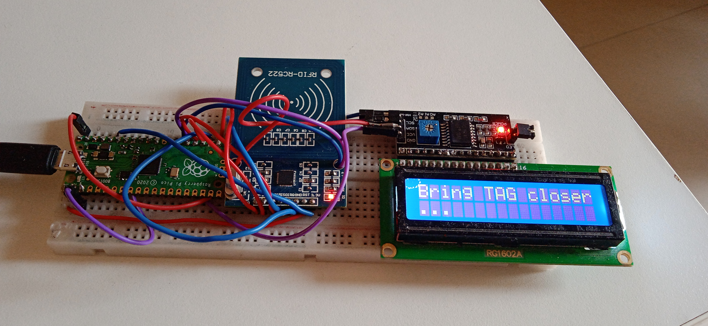
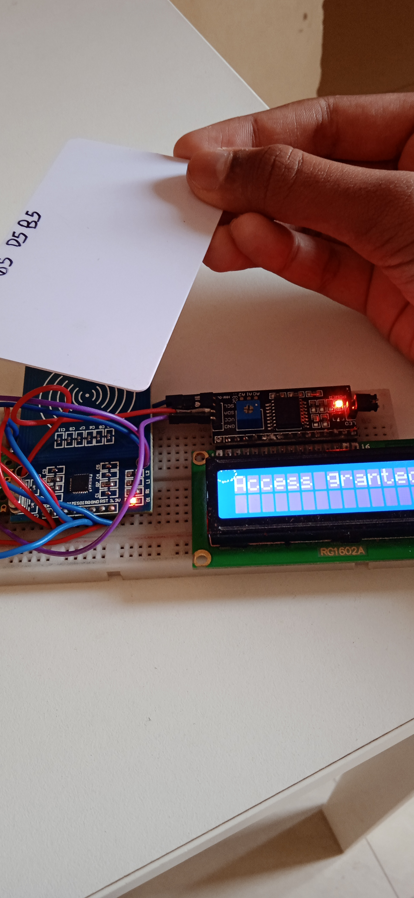

# Pico-Computer-Login
Unlocking your Computer using a Raspberry Pi Pico and RFID reader :smile:.
This is written in micropython and allows you to type your passwords using
an RFID tag. It uses a third-party hid library compiled into the 
```firmware-blank.uf2``` file. I have also used third party libraries for 
the RFID reader and I2c LCD display. And use the firmware above to create this 
project. There is a github issue for the usb hid support [usb hid support for micropython](https://github.com/micropython/micropython/issues/6811).
And this forum which helped me alot to create this project [here](https://forums.raspberrypi.com//viewtopic.php?p=1866070#p1866070).
I got the Libraries from these links: [LCD](https://www.tomshardware.com/how-to/lcd-display-raspberry-pi-pico) and [RFID](https://gist.github.com/idriszmy/9fa14377eb3b5a1859e1ff4f41464900#file-mfrc522-py). If you want to modify this code to type in your password go to this [link](http://www.freebsddiary.org/APC/usb_hid_usages.php) and check the keykode code by scrolling down to the keyboard group. First run the ```mfrc522_read.py``` to read and know your rfid tags uid and then change it in the ```main.py```. To change the uid in ```main.py``` on line 34 ```if card == 3050636775: # change this with the uid of your tag``` change the uid. And to make a key board press these lines are used:
```
report[3] = 0x04 # register 'a' keycode
usb_hid.report(usb_hid.KEYBOARD, report) # send event
time.sleep(0.1)
report[3] = 0x00 # unregister 'a' keycode
usb_hid.report(usb_hid.KEYBOARD, report) # send event
```
In the first two lines it is simulating the key press of the letter 'a' then a delay of 0.1 seconds (100 miliseconds) then in the last two lines the key is released. To change the keycode just change the value of ```report[3] = 0x04``` with something else in the above code.


# Circuit
The connections are:
1. RC522 ---------------------------PICO
2.
3. SDA/CS---------------------------GP17
4. SCK------------------------------GP18
5. MISO-----------------------------GP16
6. MOSI-----------------------------GP19
7. RST------------------------------GP0
8. GND------------------------------GND
9. VCC------------------------------3.3V
10.
11. LCD------------------------------PICO
12. 
13. SDA------------------------------GP20
14. SCK------------------------------GP21
15. GND------------------------------GND
16. VCC------------------------------VBUS




